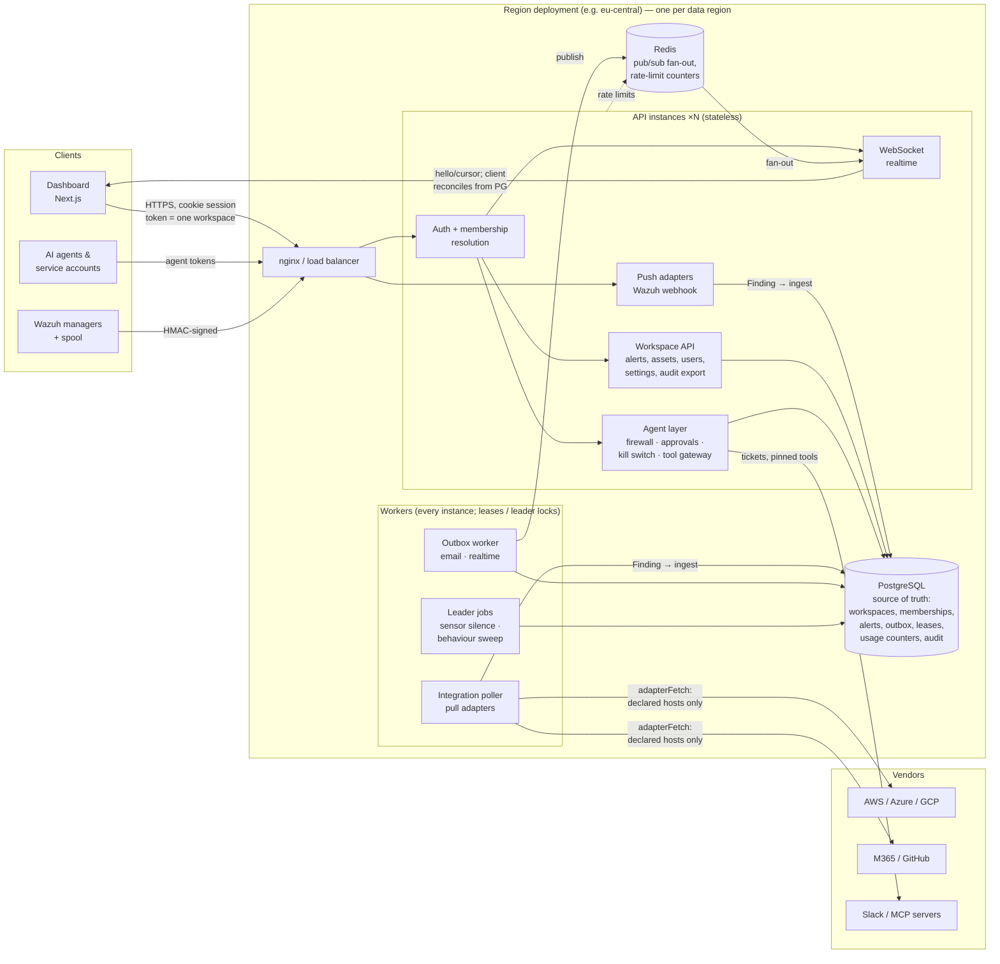

# Legion — Global SaaS Architecture (Phase 5) — 2026-09-30

Branch `claude/laughing-clarke-cmfudk`. This document is the design and the
record of what was built. Everything marked **built** is in the code and
covered by tests (§9); everything marked **seam** is a contract in the code
with its implementation deliberately left for later; **plan** is in the
migration plan (§8) only.

Guiding rule: evolve, don't rewrite. Every `tenant_id` in the schema already
meant "the organisation"; it now means "the workspace", and no table, route or
query had to be renamed.

---

## 1. Decisions in one page

| Area | Decision | Status |
|---|---|---|
| Workspaces | A person (one account, one email, one password/MFA) belongs to several workspaces through **memberships**; the membership is the only thing that lets a session act in a workspace, checked on every request. | built |
| Home workspace | The workspace that created an account owns it: deactivating the person there disables the account; any other workspace can only change or end its own membership. | built |
| Sessions | An access token and its refresh family belong to **one** workspace. Switching issues a new session; nothing in the API reads "the current workspace" from anywhere but the token. | built |
| Invitations | Addresses with an account get a membership invitation, accepted **while signed in** — never by choosing a password. The admin's answer is identical whether or not the address has an account. | built |
| Integrations | Vendor-neutral `Finding`; push and pull adapters; one idempotent ingestion path; Wazuh is an adapter (alert ids unchanged). | built |
| Pull worker | Runs on every instance; connections are leased with `FOR UPDATE SKIP LOCKED`, the lease owner fences the write-back. | built |
| Egress | Adapters reach vendors only through `adapterFetch`: HTTPS, declared hosts, no redirects, size/time caps. | built |
| Scaling | Shared state in Postgres (and Redis where it already was); per-instance state is either a cache, a per-process safety valve, or documented. | built |
| Regions | One deployment (API + DB + Redis + workers) per region; each workspace lives in exactly one region; a deployment refuses other regions' workspaces with `421` and a pointer. | built (single-region enforcement); multi-region routing is plan |
| Time & money | Wire format UTC ISO-8601 and integer minor units + ISO 4217; presentation from workspace defaults and personal overrides. | built |
| Localization | English first; en/ru/uz already in place with enforced catalogues; new text added in all three. | built |
| Enterprise | SSO (OIDC/SAML), SCIM, custom roles, outbound webhooks: contracts at existing boundaries. Audit export, API keys (service accounts), permission catalogue: built. | seam / built |

---

## 2. Architecture



The same picture in text, for readers without a Mermaid renderer:

```
            ┌───────────── Region deployment (one per data region) ─────────────┐
 Browser ──►│ LB ─► API ×N ─ auth: token → (user, workspace) → membership check  │
 Agents  ──►│         │       ├ workspace API (alerts, users, settings, export)  │
 Wazuh   ──►│         │       ├ agent layer (firewall, approvals, kill switch)   │
            │         │       └ push adapters (Wazuh) ─┐                         │
            │         │                                ▼                         │
            │         │               ingest(Finding) ─► PostgreSQL ◄─ workers:  │
            │         │               (one txn: alert,   (source of    outbox,   │
            │         │                asset, email,      truth)       poller,   │
            │         │                realtime frame)                 leader    │
            │         └─ WebSocket ◄── Redis pub/sub ◄── outbox worker  jobs     │
            │                                                                    │
            │  poller ─► adapterFetch (HTTPS, declared vendor hosts) ─► vendors  │
            └────────────────────────────────────────────────────────────────────┘
   Other regions: identical stacks with their own DB; a request for a workspace
   hosted elsewhere is answered 421 {region, region_url}.
```

---

## 3. Workspace model

### Data

```
users (account)                    workspace_memberships (source of truth)          tenants (workspace)
 id, email (unique), password,  ──<  tenant_id, user_id  (PK)                   >──  id, name, region,
 mfa, token_version,                 role: admin|analyst|viewer                     timezone, locale,
 tenant_id = HOME workspace,         status: active|invited|disabled                currency, date/time
 role/status = HOME membership,      invite_token_hash, invite_expires              formats, trial…
 default_workspace_id,               invited_by, created_at
 timezone/locale/format overrides
refresh_tokens.tenant_id = the workspace the session belongs to (NULL = home, sessions from before)
```

* **Backfill + trigger.** Every existing account got its home membership on
  first boot; a trigger keeps the home membership identical to
  `users.tenant_id/role/status`, so every pre-existing code path that writes
  `users` stays correct with no change.
* **Resolution per request.** `authenticate()` loads the membership for
  `(token.sub, token.tenant_id)` and overlays `tenant_id` and `role` on
  `req.user`. Handlers are unchanged: they still read `req.user.tenant_id`
  and `req.user.role`. Realtime sockets and their periodic re-authorization
  do the same per (user, workspace) pair. The agent layer asks the same
  resolver, so an agent owner's role is their role in the agent's workspace.
* **What a workspace can do to a member.** Change their role there; deactivate
  or remove them there (ends that workspace's sessions and sockets only). In
  the home workspace, as before, deactivation disables the account.
* **Invariants, enforced under row locks:** a workspace always keeps an active
  admin (role changes, deactivation, leaving); the home workspace cannot be left.
* **Endpoints:** `GET/POST /workspaces`, `POST /workspaces/switch`,
  `POST /workspaces/invitations/accept`, `POST /workspaces/leave`,
  `PUT /workspaces/default`; `/users*` are membership-scoped.
* **Isolation checks kept green:** the cross-tenant attack suite, the
  tenant-isolation sweep and the static tenant-query guard were updated to
  the new semantics (an existing account can be invited — and that reveals
  nothing about it and changes nothing of its other workspaces), and the
  workspace suite adds forged-workspace tokens, un-accepted invitations and
  switching data separation.

---

## 4. Integration architecture

```
             data plane (findings in)                     tool plane (actions out)
  push:  vendor ─► Legion endpoint ─► authenticate ─►     notify:  outbox ─► Slack/Teams/webhook  (seam)
         adapter.normalize(payload) ─► Finding[]          respond: agent firewall ─► MCP tools, A2A (built)
  pull:  worker ─► adapter.poll(conn, cursor) ─► Finding[] + cursor
                         │
                         ▼
           ingestFindings(workspace, source, findings)
           id = HMAC(workspace:source:externalId)  → idempotent
           one txn: alert + asset + email + realtime frame (outbox)
```

* **Contract** (`server/src/integrations/types.ts`): `Finding` (external id,
  title, severity, summary, occurred-at, source IP, target, MITRE, confidence,
  asset), `PushAdapter.normalize()` (pure, must not throw on hostile input),
  `PullAdapter.poll(conn, cursor, signal)` + `configSchema` + `secretFields`,
  and a manifest (plane, direction, auth, **egressHosts**).
* **Wazuh** is `integrations/wazuh.ts`; its HMAC authentication stays in
  `webhook-auth.ts`. The mapping and the alert-id formula are the originals
  (a test pins the id), so upgrading creates no duplicates.
* **Connections** (`integration_connections`): per workspace; secrets sealed
  with the existing secret box (AES-256-GCM, keyring, purpose + context
  bound), never returned; config validated by the adapter's schema.
* **Worker:** claims due connections (`SKIP LOCKED`, lease), polls with a
  timeout, ingests, writes the cursor **only if it still holds the lease**;
  failures back off exponentially (capped at 1 h) and park the connection in
  `error` after 10 in a row. At-least-once + idempotent ingest = exactly-once
  alerts.
* **Catalogue** (`GET /integrations/catalogue`): Wazuh, MCP and A2A available;
  AWS (Security Hub/ASFF, assumed role + external id), Azure (Defender for
  Cloud, app registration), GCP (Security Command Center, workload identity),
  GitHub (secret/code scanning, Dependabot — webhook with
  `X-Hub-Signature-256`), Microsoft 365 (Graph `alerts_v2`), Slack (outbound
  notify) listed as planned contracts with their hosts and auth.
* **Adding one:** a file implementing the contract, `register()`, a manifest.
  No change to routes, storage, the worker, notifications or isolation.

---

## 5. Horizontal scaling — where every piece of state lives

| State | Where | Multi-instance behaviour |
|---|---|---|
| Workspaces, memberships, sessions, alerts, assets, audit | Postgres | shared |
| Notification delivery (email, realtime frames) | Postgres outbox, `SKIP LOCKED`, fenced leases | each item delivered by one instance |
| Pull integrations | Postgres leases, owner-fenced | each connection polled by one instance |
| Sensor-silence check, behaviour sweep | leader lock (`pg_try_advisory_lock`) | one instance at a time; lock dies with the connection |
| AI quota | Postgres `usage_counters`, one atomic upsert per call | **fixed this phase**: was per-process (N instances = N× quota); DB error → local counting, never unlimited |
| Rate limits | Redis (per-instance fallback if Redis is down) | shared when Redis is configured |
| Realtime fan-out | Redis pub/sub; clients reconcile from Postgres cursors | missed events recovered from the DB |
| Migrations, first-run setup, demo seed | advisory locks | serialized |
| Agent firewall velocity, policy cache (5 s), behaviour cache (30 s) | per process | soft signal / short-lived cache; hard limits are the shared rate limits and DB-checked identity status |
| WebSocket caps per user/workspace | per process | protects each process; the cluster-wide ceiling is caps × instances (documented) |
| Webhook failed-auth gate, AI circuit breaker | per process | deliberately local: each protects its own process and pool |

Operators see `instance`, `region` and the mode of each shared-state piece in
the operator view of `/health`; production warns at boot when `REDIS_URL` is
missing (single-instance only).

---

## 6. Global readiness

* **Regions and residency.** `LEGION_REGION` names the region a deployment
  serves; `tenants.region` is set at creation and is not editable (moving is a
  data migration, §8). Workspaces from before regions (`NULL`) belong to the
  deployment that holds them. The API (people and agents), the Wazuh webhook
  and the integration worker refuse another region's workspace — `421
  {region, region_url}` from `LEGION_REGION_URLS` — so a misrouted client or
  sensor never writes data in the wrong place. Backups, Redis and the outbox
  are per region by construction (one stack per region).
* **Time zones.** Stored and transmitted in UTC. Workspace `timezone` is the
  organisation's reference (reports, emails); a person's own zone, if chosen,
  overrides it for display; otherwise the browser's zone is used (the previous
  behaviour). Validated against the IANA database.
* **Date and time formats.** `locale` (default: as the language writes it —
  unchanged look), `YYYY-MM-DD`, `DD.MM.YYYY`, `DD/MM/YYYY`, `MM/DD/YYYY`;
  `locale`/`24h`/`12h`. Workspace default, personal override.
* **Localization.** English is the source language; Russian and Uzbek are
  complete and CI refuses a missing key (frontend TypeScript + check-i18n,
  server catalogue test). Adding a language = one more column in each
  catalogue; nothing structural.
* **Currencies.** `SUPPORTED_CURRENCIES` (default USD,EUR), a workspace
  billing currency (locked while a subscription is active), and
  `PADDLE_PRICE_IDS` so the **server** chooses the price for the workspace's
  currency at checkout. Money is integer minor units + ISO 4217 (`Money` type).

---

## 7. Enterprise extension points

| Capability | Where it plugs in | Status |
|---|---|---|
| SSO — OIDC / SAML | `enterprise.ts` `IdentityProvider` → `ExternalIdentity` → existing `startSession()` (landing, MFA policy, device notice). `SsoPolicy`: verified domains, invite-only vs JIT, group→role, enforce SSO. | seam |
| SCIM 2.0 | `ScimProvisioner` → the membership functions in `workspaces.ts` (same locks, same audit). | seam |
| Enterprise RBAC | Routes ask for a permission (`permissions.ts`, `requirePermission`); custom roles replace `roleAllows()`. `GET /workspace/roles` exposes the matrix. | built (catalogue) / seam (custom roles) |
| Audit export | `GET /audit/export?from&to&format=ndjson|csv` — streamed, time-ordered, CSV-injection-safe, itself audited; agent audit via `/audit/principal-events`. | built |
| API keys / service accounts | Machine identities (packages/agent-identity): scoped permissions, 15-min tokens, rotation, revocation, firewall, kill switch. | built |
| Outbound webhooks / SIEM streaming | A notify adapter delivered through the outbox (retries, dead letters), signed like the inbound scheme. | seam |

---

## 8. Migration plan

Each step is deployable on its own, backward compatible, and has a rollback.

**Step 0 — this change (deploy as usual).**
All schema changes are additive (`CREATE TABLE IF NOT EXISTS`, `ADD COLUMN IF
NOT EXISTS`, idempotent backfill, trigger). On first boot every account gets
its home membership; tokens and refresh sessions issued before the deploy keep
working (their workspace is the home one). Rolling deploys are safe: old and
new instances agree on everything old instances read. *Rollback:* redeploy the
previous build; the new tables and columns are ignored by it (memberships
created meanwhile for non-home workspaces simply stop granting access).
*Verify:* `/health` (operator) shows region and shared-state modes; the
workspace, integration and scaling suites pass against the deployed DB.

**Step 1 — adoption (no infrastructure change).**
Ship the dashboard with the workspace switcher, the existing-account invite
flow and Settings → Region and formats (included). Set `LEGION_REGION` and
`SUPPORTED_CURRENCIES`/`PADDLE_PRICE_IDS` explicitly. Run more than one API
instance only with `REDIS_URL` set.

**Step 2 — first pull integrations.**
Implement AWS Security Hub and Microsoft 365 against the contract (each: one
adapter file, manifest, recorded-response tests; credentials by assumed role /
app registration). Enable per workspace in Settings → Integrations. Watch
`last_error`/`failures` per connection. *Rollback:* pause or remove the
connection; ingested alerts remain.

**Step 3 — second region.**
Stand up an identical stack (API, workers, Postgres, Redis, backups) with
`LEGION_REGION=<new>`; set `LEGION_REGION_URLS` on every region. New
workspaces for that region are created there. Two pieces are added in this step:
(a) a small **global directory** (email → home region, workspace → region) so
sign-in and invitations route to the right region before a session exists —
the only cross-region data, holding no security data; (b) sign-up asks for the
data region. Moving an existing workspace is an offline, per-workspace export
→ import (all rows keyed by `tenant_id`; memberships whose account lives in
another region become invitations) followed by flipping `tenants.region`.
*Rollback:* the new region is independent; nothing in the old one changed.

**Step 4 — enterprise.**
OIDC first (then SAML) behind the `IdentityProvider` contract, with verified
domains; SCIM on the `ScimProvisioner` contract; custom roles by replacing
`roleAllows`; outbound webhooks as a notify adapter. Each is additive and
off by default per workspace.

---

## 9. Evidence

New suites (server): `workspaces.test.ts` (13), `integrations.test.ts` (15),
`scaling.test.ts` (4), `global-readiness.test.ts` (11); updated:
`api.test.ts`, `cross-tenant-attacks.test.ts`, `tenant-isolation-sweep.test.ts`,
`tenant-query-guard.test.ts`, `ai-hardening.test.ts`, `i18n.test.ts`
(catalogue). Frontend: `lib/i18n/format.test.ts` (3), lint + i18n check.

Full runs on the final code (PostgreSQL 16, Redis, 2026-09-30):

| Suite | Result |
|---|---|
| server — all 45 files, failure injection required | 1062 passed + 2 failed on the first run: both guard tests needing updates for this phase (the invite preview's new `existing_account` field; two new whitelisted-column UPDATEs added to the reviewed list with reasons) — 60/60 on re-run of those files |
| server — new suites | workspaces 13, integrations 15, scaling 4, global-readiness 11 |
| packages/agent-identity | 802 passed |
| frontend — vitest / lint + i18n check / production build | 129 passed / OK / OK |
| ops/tests/e2e-wazuh.mjs (provisioned DB, API as restricted app role, real integration script, agents) | all checks passed |
| integrations/test_custom_legion.py, CI gate | OK |

## 10. Known limits (honest list)

* Multi-region is enforced (refusal) but not yet *routed*: sign-in for an
  account whose home is another region needs the global directory (Step 3).
* The WebSocket per-workspace cap and the agent firewall's velocity signal
  are per process (see §5).
* SSO, SCIM, custom roles and outbound webhooks are contracts, not features.
* The billing currency is a workspace setting and a server-chosen price; tax,
  invoicing and FX stay with Paddle.
* A workspace's region cannot be changed in place (by design).
